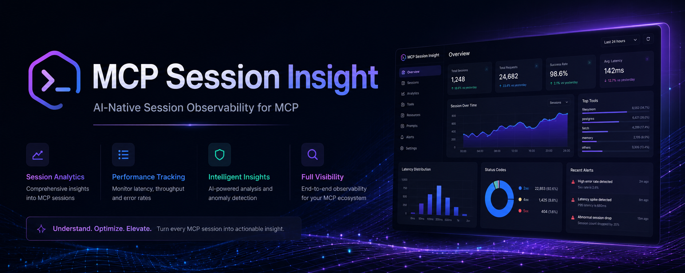

<div align="center">

# MCP Session Insight

**AI-Native Session Observability for Claude Code**

[简体中文](README_zh.md) | **English**


</div>

---

## Why session-insight?

Claude Code sessions accumulate rich context — file changes, user requests, decisions, errors, git history — but that context vanishes when the session ends. `CLAUDE.md` stores static rules, but can't answer "what did I work on today?" or "what went wrong in that last session?".

session-insight gives your AI assistant a **read-only lens into all past sessions**:

- **Session analytics** — extract structured insights from JSONL: file changes, decisions, errors, tool usage, todo progress
- **EnrichedSummary** — returns structured JSON instead of Markdown templates, letting the calling LLM synthesize concise summaries at zero extra API cost
- **Cross-project git logs** — collect commit history across all projects with date range, project, and author filters
- **Semantic classification** — bash commands classified into 9 categories (build/test/deploy/debug/network/run/git/explore/other)
- **Session handoff** — generate structured context for seamless session continuation

## Quick Start

```bash
# Install
npm install -g @morningljn/mcp-session-insight

# One-command setup
claude mcp add session-insight -- npx @morningljn/mcp-session-insight
```

Restart your AI assistant and it can now query all past sessions.

### Manual Setup

Add to `~/.claude/mcp.json`:

```json
{
  "mcpServers": {
    "session-insight": {
      "command": "npx",
      "args": ["@morningljn/mcp-session-insight"]
    }
  }
}
```

## Tools

| Tool | Description |
|------|-------------|
| `list_sessions` | List all sessions with optional project filter and limit |
| `show_session` | Show session metadata (supports prefix matching on session ID) |
| `search_sessions` | Search sessions by keyword in content or ID |
| `get_session_summary` | Returns EnrichedSummary JSON for LLM synthesis |
| `get_session_changes` | Get file changes (created / modified / read) |
| `get_session_requests` | Get deduplicated user requests |
| `get_session_todos` | Get todo progress snapshots |
| `get_session_errors` | Get errors and issues with context |
| `get_session_decisions` | Get key decisions from thinking blocks |
| `get_session_conversation` | Get conversation history with role filter |
| `get_git_logs` | Collect git commit logs across projects |

### `get_session_summary` (EnrichedSummary)

Returns structured JSON instead of formatted text. The calling LLM reads the data and synthesizes a concise summary — zero extra API cost.

```json
{
  "sessionDuration": "116min",
  "messageDensity": "low",
  "classifiedBash": [{ "cmd": "npm test", "category": "test" }],
  "errorsWithContext": [{ "message": "...", "trigger": "Bash", "relatedFile": "src/server.ts" }],
  "fileChangeGroups": [{ "directory": "src", "created": ["git.ts"], "modified": [] }],
  "dedupedRequests": ["refactor summary to structured JSON"],
  "decisions": ["use Jaccard trigram for dedup"],
  "toolStats": { "Bash": 93, "Read": 39, "Edit": 38 },
  "gitActions": ["git commit -m \"feat: ...\"", "git push origin main"]
}
```

### `get_git_logs`

Collect git commit history across all Claude Code projects:

```json
[
  {
    "project": "/Users/user/project",
    "projectName": "my-app",
    "commits": [
      { "hash": "a1b2c3d", "message": "feat: add auth", "author": "user", "date": "2026-05-20T10:00:00+08:00", "files": ["src/auth.ts"] }
    ]
  }
]
```

## Architecture

```
┌───────────────────┐   stdio    ┌──────────────────┐   read     ┌──────────────────────────┐
│   MCP Client      │◄─────────►│ session-insight  │◄──────────►│ ~/.claude/projects/      │
│ (Claude / Codex)  │   JSON    │     server       │            │                          │
└───────────────────┘           └───────┬──────────┘            │  ┌─project-a/            │
                                        │                       │  │  ├─session-1.jsonl     │
                                 ┌──────┴──────┐                │  │  └─session-2.jsonl     │
                                 │             │                │  └─project-b/            │
                                 │  Extractor  │   Git Log      │     └─session-3.jsonl     │
                                 │  (summary,  │   Collector    │                          │
                                 │   classify, │   (git log     └──────────────────────────┘
                                 │   dedup,    │    per project)
                                 │   errors)   │
                                 └─────────────┘
```

**Key design decisions:**

- **Stateless** — no database, no persistence, reads JSONL directly on each request
- **Zero dependencies** — only `@modelcontextprotocol/sdk`, all processing is pure computation
- **LLM-friendly output** — structured JSON that the calling LLM synthesizes into natural language

## Development

```bash
npm install
npm test        # run tests with vitest
npm run build   # compile TypeScript
npm start       # start MCP server
```

## License

MIT
